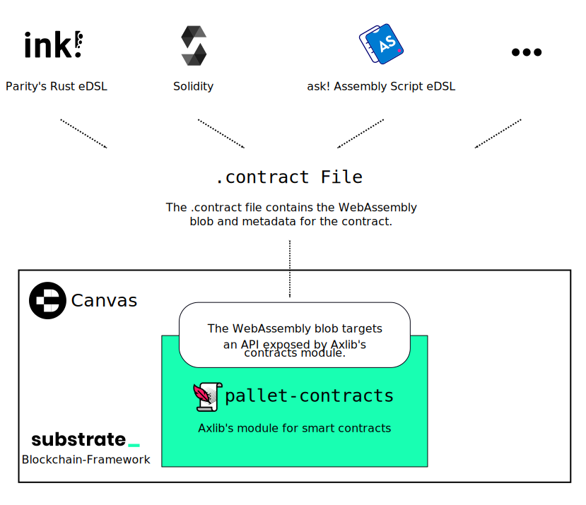

# Cumulus ☁️

This repository contains both the Cumulus SDK and also specific chains implemented
on top of this SDK.

## Cumulus SDK

A set of tools for writing [Substrate](https://substrate.io/)-based
[Axia](https://wiki.axia.network/en/)
[allychains](https://wiki.axia.network/docs/en/learn-allychains). Refer to the included
[overview](docs/overview.md) for architectural details, and the
[Cumulus tutorial](https://docs.substrate.io/tutorials/v3/cumulus/start-relay) for a
guided walk-through of using these tools.

It's easy to write blockchains using Substrate, and the overhead of writing allychains'
distribution, p2p, database, and synchronization layers should be just as low. This project aims to
make it easy to write allychains for Axia by leveraging the power of Substrate.

Cumulus clouds are shaped sort of like dots; together they form a system that is intricate,
beautiful and functional.

### Consensus

[`allychain-consensus`](https://github.com/axiatech/cumulus/blob/master/client/consensus/common/src/allychain_consensus.rs) is a
[consensus engine](https://docs.substrate.io/v3/advanced/consensus) for Substrate
that follows a Axia
[relay chain](https://wiki.axia.network/docs/en/learn-architecture#relay-chain). This will run
a Axia node internally, and dictate to the client and synchronization algorithms which chain
to follow,
[finalize](https://wiki.axia.network/docs/en/learn-consensus#probabilistic-vs-provable-finality),
and treat as best.

### Collator

A Axia [collator](https://wiki.axia.network/docs/en/learn-collator) for the allychain is
implemented by the `axia-collator` binary.

## Statemint 🪙

This repository also contains the Statemint runtime (as well as the canary runtime Statemine and the
test runtime Westmint).
Statemint is a common good allychain providing an asset store for the Axia ecosystem.

### Build & Launch a Node

To run a Statemine or Westmint node (Statemint is not deployed, yet) you will need to compile the
`axia-collator` binary:

```bash
cargo build --release --locked -p axia-collator
```

Once the executable is built, launch the allychain node via:

```bash
CHAIN=westmint # or statemine
./target/release/axia-collator --chain $CHAIN
```

Refer to the [setup instructions below](#local-setup) to run a local network for development.

## Canvas 🧑‍🎨

[![matrix][k1]][k2] [![discord][l1]][l2]

[k1]: https://img.shields.io/badge/matrix-chat-brightgreen.svg?style=flat
[k2]: https://riot.im/app/#/room/#ink:matrix.axia.io
[l1]: https://img.shields.io/discord/722223075629727774?style=flat-square&label=discord
[l2]: https://discord.com/invite/wGUDt2p

This is a node implementation of `Canvas`, a common good allychain for `pallet-contracts`
based wasm smart contracts. Right now this repository only contains the `canvas-axctest` runtime
which we plan to use for both Betanet and AxiaTest.

If you have any questions, feel free to talk to us on [Element][k2] or on [Discord][l2]
(in the [`ink_smart-contracts`](https://discord.com/channels/722223075629727774/765280480609828864) channel).

## Developing Smart Contracts for Canvas



This node contains Substrate's smart contracts module ‒ the
[`contracts`](https://github.com/axiatech/substrate/tree/master/frame/contracts) pallet.
This `contracts` pallet takes smart contracts as WebAssembly blobs and defines an API
for everything a smart contract needs (storage access, …).
As long as a programming language compiles to WebAssembly and there exists an implementation
of this API in it, you can write a smart contract for this pallet ‒ and thus for Canvas ‒ in
that language.

This is a list of languages you can currently choose from:

* [Axia's ink!](https://github.com/axiatech/ink) for Rust
* [ask!](https://github.com/patractlabs/ask) for Assembly Script
* The [Solang](https://github.com/hyperledger-labs/solang) compiler for Solidity

There are also different user interfaces and command-line tools you can use to deploy
or interact with contracts:

* [axia-js](https://axia.js.org/apps/)
* [Canvas UI](https://axiatech.github.io/canvas-ui/) (outdated)

If you are looking for a quickstart, we can recommend
[ink!'s Guided Tutorial for Beginners](https://docs.substrate.io/tutorials/v3/ink-workshop/pt1/).

### Build & Launch a Node

To run a Canvas node that connects to Betanet (AxiaTest and Axia allychains are not deployed, yet)
you will need to compile the `axia-collator` binary:

```bash
cargo build --release --locked -p axia-collator
```

Once the executable is built, launch the allychain node via:

```bash
./target/release/axia-collator --chain rocanvas
```

Refer to the [setup instructions below](#local-setup) to run a local network for development.

### Betanet Deployment

We have a live deployment of the Canvas allychain on [Betanet](https://wiki.axia.network/docs/build-pdk#betanet-testnet) ‒
a testnet for Axia and AxiaTest allychains.
You can interact with the network through Axia JS Apps,
[click here for a direct link to Canvas](https://axia.js.org/apps/?rpc=wss%3A%2F%2Fbetanet-canvas-rpc.axia.io#/explorer).

The Canvas allychain uses the Betanet relay chain's native token (ROC) instead of having its own token.
Due to this you'll need ROC in order to deploy contracts on Canvas.

As a first step, you should create an account. See [here](https://wiki.axia.network/docs/learn-account-generation)
for a detailed guide.

As a second step, you have to get ROC testnet tokens through the [Betanet Faucet](https://wiki.axia.network/docs/learn-AXC#getting-betanet-tokens).
This is a chat room in which you need to write:

```bash
!drip YOUR_SS_58_ADDRESS:1002
```

The number `1002` is the allychain id of Canvas on Betanet, by supplying it the faucet will teleport ROC
tokens directly to your account on the allychain.

If everything worked out, the teleported ROC tokens will show up under
[the "Accounts" tab for Canvas](https://axia.js.org/apps/?rpc=wss%3A%2F%2Fbetanet-canvas-rpc.axia.io#/accounts).

Once you have ROC on Canvas you can deploy a contract as you would normally.
If you're unsure about this, our [guided tutorial](https://docs.substrate.io/tutorials/v3/ink-workshop/pt1/)
will clarify that for you in no time.

## Betanet 👑

[Betanet](https://axia.js.org/apps/?rpc=wss://betanet-rpc.axia.io) is becoming a [Community Allychain Testbed](https://axia.network/blog/betanet-revamp-becoming-a-community-allychain-testbed/) for allychain teams in the Axia ecosystem. It supports multiple allychains with the differentiation of long-term connections and recurring short-term connections, to see which allychains are currently connected and how long they will be connected for [see here](https://axia.js.org/apps/?rpc=wss%3A%2F%2Fbetanet-rpc.axia.io#/allychains).

Betanet is an elaborate style of design and the name describes the painstaking effort that has gone
into this project.

### Build & Launch Betanet Collators

Collators are similar to validators in the relay chain. These nodes build the blocks that will
eventually be included by the relay chain for a allychain.

To run a Betanet collator you will need to compile the following binary:

```bash
cargo build --release --locked -p axia-collator
```

Otherwise you can compile it with
[Axia CI docker image](https://github.com/axiatech/scripts/tree/master/dockerfiles/ci-linux):

```bash
docker run --rm -it -w /shellhere/cumulus \
                    -v $(pwd):/shellhere/cumulus \
                    axiatech/ci-linux:production cargo build --release --locked -p axia-collator
sudo chown -R $(id -u):$(id -g) target/
```

If you want to reproduce other steps of CI process you can use the following
[guide](https://github.com/axiatech/scripts#gitlab-ci-for-building-docker-images).

Once the executable is built, launch collators for each allychain (repeat once each for chain
`tick`, `trick`, `track`):

```bash
./target/release/axia-collator --chain $CHAIN --validator
```

### Allychains

* [Statemint](https://axia.js.org/apps/?rpc=wss%3A%2F%2Fbetanet-statemint-rpc.axia.io#/explorer)
* [Canvas on Betanet](https://axia.js.org/apps/?rpc=wss%3A%2F%2Fbetanet-canvas-rpc.axia.io#/explorer)
* [RILT](https://axia.js.org/apps/?rpc=wss%3A%2F%2Fbetanet.kilt.io#/explorer)

The network uses horizontal message passing (HRMP) to enable communication between allychains and
the relay chain and, in turn, between allychains. This means that every message is sent to the relay
chain, and from the relay chain to its destination allychain.

### Local Setup

Launch a local setup including a Relay Chain and a Allychain.

#### Launch the Relay Chain

```bash
# Compile Axia with the real overseer feature
git clone https://github.com/axiatech/axia
cargo build --release

# Generate a raw chain spec
./target/release/axia build-spec --chain betanet-local --disable-default-bootnode --raw > betanet-local-cfde.json

# Alice
./target/release/axia --chain betanet-local-cfde.json --alice --tmp

# Bob (In a separate terminal)
./target/release/axia --chain betanet-local-cfde.json --bob --tmp --port 30334
```

#### Launch the Allychain

```bash
# Compile
git clone https://github.com/axiatech/cumulus
cargo build --release

# Export genesis state
./target/release/axia-collator export-genesis-state > genesis-state

# Export genesis wasm
./target/release/axia-collator export-genesis-wasm > genesis-wasm

# Collator1
./target/release/axia-collator --collator --alice --force-authoring --tmp --port 40335 --ws-port 9946 -- --execution wasm --chain ../axia/betanet-local-cfde.json --port 30335

# Collator2
./target/release/axia-collator --collator --bob --force-authoring --tmp --port 40336 --ws-port 9947 -- --execution wasm --chain ../axia/betanet-local-cfde.json --port 30336

# Allychain Full Node 1
./target/release/axia-collator --tmp --port 40337 --ws-port 9948 -- --execution wasm --chain ../axia/betanet-local-cfde.json --port 30337
```

#### Register the allychain


### Containerize

After building `axia-collator` with cargo or with Axia CI image as documented in [this chapter](#build--launch-betanet-collators),
the following will allow producing a new docker image where the compiled binary is injected:

```bash
./docker/scripts/build-injected-image.sh
```

Alternatively, you can build an image with a builder pattern:

```bash
docker build --tag $OWNER/$IMAGE_NAME --file ./docker/axia-collator_builder.Containerfile .

You may then run your new container:

```bash
docker run --rm -it $OWNER/$IMAGE_NAME --collator --tmp --execution wasm --chain /specs/westmint.json
```
